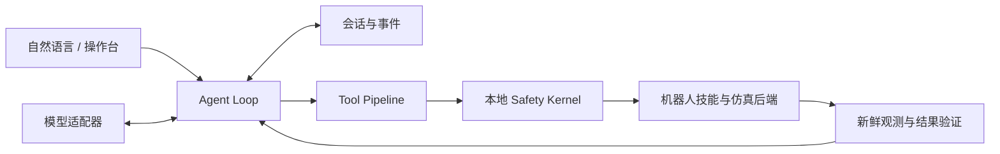

# Luxi Embodied Agent

Luxi Embodied Agent 是面向机器人仿真的具身 Agent 运行框架。它将自然语言任务、实时 RGB-D 观测、机器人技能和结果验证接入同一执行循环，提供 Unitree G1 / Go2 的仿真适配与本地操作台。

项目基于固定版本的 [DimOS](https://github.com/dimensionalOS/dimos)，维护独立的 Harness、控制适配和安全逻辑。第三方源码、Python 环境、模型及运行数据保存在仓库外。

## 核心能力

- **统一任务执行**：模型负责提出工具调用，Harness 管理会话、权限、执行、取消与结果验证。
- **视觉与导航**：使用第一视角 RGB-D、里程计和在线地图支持定位、接近、搜索与跟随；实际可用工具由后端准入配置决定。
- **本地操作台**：查看相机、地图、任务进度和工具事件，发送语言指令、手动控制、急停与复位。
- **基于证据的任务完成**：工具返回成功、机器人停稳、规划器到达和用户任务完成分别记录。
- **组合任务研究**：支持经用户确认的目标、依赖计划与逐步验证；MuJoCo 的模拟附着/放置是实验能力，不等于接触抓取。



## 支持范围

| 路径 | 用途 | 所需环境 |
| --- | --- | --- |
| **MuJoCo / G1** | 默认安装和操作台复现路径 | Linux x86_64、NVIDIA GPU、桌面或 EGL |
| MuJoCo / Go2 | 单机器人仓库巡检、搜索、跟随 | 默认环境 + Docker / FAST-LIO2 |
| Isaac Sim / G1 | Isaac 的传感器、运动与导航适配 | Isaac Sim 5.1、额外 G1 USD / 策略和参考控制器 |

Isaac 的外部工作区和资产不随本仓库提供，不能仅靠下面的 MuJoCo 安装命令复现。各后端的默认工具集合见 [physical-cutover.json](config/physical-cutover.json)。这些配置保留历史准入状态；原始验收报告不随公开源码提供，不代表所有场景都已通过验证。

## 快速开始

### 1. 获取源码

```bash
git clone https://github.com/LuxiTech/luxi-embodied-agent-harness.git
cd luxi-embodied-agent-harness
```

后续命令均在仓库根目录执行。公开源码不依赖本地开发记录、实验日志或个人配置。

### 2. 准备 MuJoCo 主机

默认路径面向 Ubuntu/Debian 系 **x86_64** 工作站，运行环境由安装器提供 **Python 3.12**。

| 资源 | 要求 |
| --- | --- |
| 内存 | 建议至少 16 GiB |
| 磁盘 | Asset 目录至少预留 30 GiB，下载缓存可能需要更多空间 |
| GPU | NVIDIA；基础仿真启动要求至少 4 GiB 空闲显存，工具/操作台至少 6 GiB |
| 图形 | 桌面演示需要可用的 `DISPLAY`；纯 SSH 使用本文“无头部署”说明 |
| 网络 | 安装时需访问 GitHub、Python 包源及上游模型/资产下载源 |

先安装系统依赖（需要本机管理员权限）：

```bash
sudo apt-get update
sudo apt-get install -y \
  git git-lfs curl ca-certificates build-essential pkg-config dpkg \
  iproute2 procps wmctrl libgl1 libegl1 libglib2.0-0 libportaudio2 \
  libx11-6 libxrandr2 libxinerama1 libxcursor1 libxi6
git lfs install
```

创建个人配置：

```bash
cp config/dimos.env.example config/dimos.local.env
./scripts/dimos.sh preflight
```

默认资产根目录是 `$HOME/work/Asset/dimos`。换盘时修改 `config/dimos.local.env` 中的 `DIMOS_ASSET_ROOT`；不要修改版本锁。预检必须没有 `FAIL`。

若提示 LCM 组播路由或接收缓冲不足，配置当前启动周期的网络参数，再运行预检：

```bash
sudo ip route replace 224.0.0.0/4 dev lo
sudo ip link set lo multicast on
sudo sysctl -w net.core.rmem_max=67108864
sudo sysctl -w net.core.rmem_default=67108864
```

### 3. 安装固定环境

```bash
./scripts/dimos.sh bootstrap
./scripts/dimos.sh doctor
```

安装器使用 [版本配置](config/dimos-version.env) 指定的 DimOS 提交、上游依赖锁、Menagerie 提交和 OpenCV contrib 版本。下载和安装均进入 `DIMOS_ASSET_ROOT`，不向系统 Python 或当前 Conda 环境安装包。

`doctor` 应显示版本、Python 导入、模型资产和 G1 blueprint 检查通过。它验证安装完整性，不代表机器人任务已完成。

### 4. 启动机器人与操作台

先运行基础仿真：

```bash
./scripts/dimos.sh g1-basic
```

`g1-basic` 应显示 G1 并保持前台运行；观察后按 **Ctrl+C** 停止，再启动操作台，避免两个实例同时占用控制通道：

```bash
./scripts/luxi-ui.sh
```

打开 **http://127.0.0.1:8787/**。确认第一视角持续刷新、地图出现观测数据、运行时就绪。未配置模型时可检查仿真和界面；自然语言任务需要下一步的模型配置。

### 5. 配置自然语言任务

密钥放在仓库外。下面的 Bash 输入不会显示密钥，也不会把密钥正文写入 shell 历史：

```bash
install -d -m 700 "$HOME/.config/luxi"
(umask 077
 read -r -s -p 'Qwen API key: ' luxi_api_key
 printf '\n'
 printf '%s' "$luxi_api_key" > "$HOME/.config/luxi/qwen.key"
)
chmod 600 "$HOME/.config/luxi/qwen.key"
```

在 `config/dimos.local.env` 中配置路径和模型名称：

```bash
export LUXI_MODEL_PROVIDER=qwen
export LUXI_QWEN_API_KEY_FILE="${HOME}/.config/luxi/qwen.key"
export LUXI_QWEN_BASE_URL="https://dashscope.aliyuncs.com/compatible-mode/v1"
export LUXI_QWEN_MODEL="qwen3.7-max"
export LUXI_QWEN_VISION="0"
export LUXI_DIMOS_VLM_MODEL="qwen3.7-plus"
```

这些是项目配置中的模型名称；账户需具备对应模型的访问权限。若服务商不提供该名称，分别配置支持工具调用的文本模型和支持图像输入的视觉模型；更换视觉模型家族还需核对框坐标协议：当前兼容层按模型家族处理，Qwen3 使用归一化框坐标，Qwen2.5 旧版 `bbox` 使用像素坐标；其他家族需要适配后才能用于定位。真实任务会产生模型 API 请求和费用。

停止并重新启动操作台，使配置生效。在运行时就绪后，可先发送“转身”，并检查结构化任务结果和停稳证据；再测试当前场景可见目标的接近、搜索或跟随。目标不可见、路线受阻或证据不足时，系统会返回未完成，不把受理指令当作成功。

## 运行与排障

- 启动失败先运行 `./scripts/dimos.sh preflight` 和 `./scripts/dimos.sh doctor`，检查资产、图形环境、显存及 LCM 配置。
- 同一控制通道只运行一个仿真实例。前台进程使用 **Ctrl+C** 停止；独立 DimOS 实例可用 `./scripts/dimos.sh status` 查看、`./scripts/dimos.sh stop` 停止。
- 操作台“运行时就绪”只说明服务和观测可用。任务是否完成以结构化结果的 `completed` 和最终验证证据为准，不能以模型文字或工具受理结果代替。
- 仓库不提供开发测试集、纯验收脚本及历史验收报告；安装诊断不代表现场任务验收。

## 扩展后端与组合任务

### 动态组合模式

完成默认安装和模型配置后，先停止普通操作台，再运行：

```bash
source scripts/lib/dimos_env.sh
python scripts/composed_dashboard.py --backend mujoco --port 8787 --no-browser
```

打开 http://127.0.0.1:8787/，选择组合模式并提交指令，核对目标后点击“确认目标并执行”。模型生成步骤计划，再逐次调用技能；只有 `compose_verify` 能宣布整个任务完成。按 **Ctrl+C** 关闭操作台及其托管仿真。

候选取放使用 `sim_attachment` / `sim_placement`：到位停稳后，物体可瞬移到掌心或标注桌面；这不是真实接触抓取。导航、精调与取放交接共用 0.15 m / 0.15 rad 的到位容差；普通位置目标可以不要求终点朝向。运输和放置前检查当前持物，`acquired` 保存取物历史，`placed_on` 验证最终放置状态。

[可信位置目录](config/composed/home_complex-locations.json) 只适用于 `home_complex` 场景：厨房提供视觉搜索入口，RGB-D 定位生成取物位姿；客厅桌面和厨房固定归还点分别提供机器人站位、桌面放物点与合法区域。“厨房原位置”是固定标注点，不记录每次拿起前的位置。可尝试“将厨房的水放到客厅的桌子上”；缺少目标引用、路径被阻断或放置点被占用时，应返回未完成。当前后端只声明水瓶操作能力，跨任务持物接续及任意桌面搜索并未完整接通。

### 单 Go2

需要 Docker 和固定 FAST-LIO2 镜像：

```bash
./scripts/dimos.sh go2-fastlio-build
./scripts/luxi-ui.sh --backend mujoco-go2
```

可选 ROS 2 Humble 容器模式使用单机器人 `go2-01`、命名空间 `/go2_01`：

```bash
docker compose -f docker/compose.go2-ros.yml build
LUXI_GO2_EXTERNAL_ROS_AGENT=1 MUJOCO_GL=egl ./scripts/luxi-ui.sh --backend mujoco-go2 --no-browser
```

宿主运行仿真和 Harness；容器负责传感器、FAST-LIO2 与本地控制。代码变更后需重建镜像。坐标路线到达不等于视觉寻物成功。

### Isaac G1

该后端需要用户单独准备 Isaac Sim 5.1 镜像、G1 USD、`policy1.onnx`、ONNX Runtime、`g1_locomotion_controller.py` 参考控制器及 Genie Sim 版本元数据。它们不随源码提供，默认 MuJoCo 安装器也不安装它们。

在个人配置中设置 `LUXI_ISAAC_IMAGE`、`LUXI_ISAAC_ASSET_ROOT`、`LUXI_ISAAC_REFERENCE_ROOT` 和 `LUXI_GENIE_SIM_ROOT`；目录要求以 [Isaac 启动脚本](scripts/isaac_g1.sh) 的 `doctor` 检查为准。准备完毕后运行：

```bash
./scripts/dimos.sh isaac-doctor
./scripts/luxi-ui.sh --backend isaac-g1
```

该路径支持新鲜 RGB-D、RTX lidar、里程计与已观测可通行区域内的导航；不提供完整官方 Genie Sim 任务栈，也不保证跨楼层或未知空间导航。

### 无头部署

同机无窗口运行可使用 EGL，仍由操作台托管仿真：

```bash
LUXI_MUJOCO_HEADLESS=1 MUJOCO_GL=egl ./scripts/luxi-ui.sh --no-browser
```

SSH 可通过 `ssh -L 8787:127.0.0.1:8787 <主机>` 转发操作台。需要隔离的 MuJoCo/MCP 服务时，可使用仓库中的 Docker 配置；主机需安装 Docker Compose 和 NVIDIA Container Toolkit：

```bash
cp docker/.env.example docker/.env
# 将 DIMOS_UID / DIMOS_GID 设置为本机 id -u / id -g 的结果。
# 需要视觉模型时，将 LUXI_QWEN_KEY_FILE 设置为仓库外密钥文件的绝对路径。
docker compose --env-file docker/.env -f docker/compose.yml build
docker compose --env-file docker/.env -f docker/compose.yml up -d
docker compose --env-file docker/.env -f docker/compose.yml logs -f
```

容器只提供仿真和 MCP，不包含操作台 Agent Loop。默认仅将 MCP 映射到宿主 `127.0.0.1:9990`；其运行卷独立，不能仅凭 MCP 端口可达就认定宿主操作台已接通相机和控制通道。需要完整操作台时优先使用上面的同机 EGL 方式。停止容器使用：

```bash
docker compose --env-file docker/.env -f docker/compose.yml down
```

## 发布范围与代码结构

公开源码包含下列运行目录，以及 `README.md`、`LICENSE`、`.gitignore` 和 `.dockerignore`。
配置目录只提供模板与公共运行配置；个人 `.env` 文件不随仓库分发。人物素材的来源说明和许可证随素材保留。
开发文档、测试集、CI、纯验收脚本、根目录两个 `.txt` 文件及本地开发记录不包含在发布范围中。

```text
harness/
  runtime/        Agent Loop、会话、工具流水线与能力准入
  control/        取消、导航保护和安全恢复
  robots/         G1 / Go2 与 MuJoCo / Isaac 适配
  skills/         视觉、运动、物体和组合技能
  integrations/   DimOS、Qwen、MCP 集成
  app/            本地 HTTP 操作台与静态页面
  evaluation/     契约实验和任务验收
config/           版本、能力准入和任务配置
scripts/          安装、启动、控制及所需诊断依赖
native/           FAST-LIO2 仿真原生组件
reference/assets/ 运行所需的人物素材及来源说明
```

## 已知限制与路线图

- 默认复现基线为 MuJoCo G1；Isaac 依赖额外工作区，Go2 需要额外原生容器。
- 动态取放使用 `sim_attachment` / `sim_placement`，没有宣称真实接触抓取或真机部署完成。
- 导航依赖当前可观测、可通行空间；不保证任意自然语言任务、任意地图都能完成。
- 后续工作：补齐跨场景物理验收、简化可选后端安装、拆分较大的运行时和视觉模块。

## 贡献与第三方依赖

欢迎通过 GitHub Issues 报告问题、通过 Pull Requests 提交改进。请附后端、版本、复现命令、预期结果和脱敏后的错误摘要；说明变更验证方式。不要提交密钥、模型、运行记录或个人配置。

### 项目许可证

除另有声明的第三方代码和素材外，本项目原创代码采用 [Apache License 2.0](LICENSE)。第三方组件、模型和素材继续适用各自的许可证。

### 第三方来源与许可证

本仓库维护 Luxi Harness 和适配代码。多数上游软件、模型及仿真资产单独下载到 `DIMOS_ASSET_ROOT`；本项目的许可证不替代第三方组件各自的许可证。

| 组件 | 提供方式 | 来源与许可证说明 |
| --- | --- | --- |
| DimOS | 仓库提供集成代码，安装时下载固定提交的上游源码 | [dimensionalOS/dimos](https://github.com/dimensionalOS/dimos)，Apache-2.0；固定提交见 [版本配置](config/dimos-version.env) |
| MuJoCo / mujoco-playground / Menagerie | bootstrap 下载，不随本仓库分发 | 保留固定版本软件包、Menagerie 及各素材附带的许可证和声明 |
| Quaternius 人物素材 | 仓库包含 glTF、网格及引用的纹理 | [来源说明](reference/assets/person/quaternius/SOURCE.md)、[随附许可证](reference/assets/person/quaternius/License_Standard.txt) |
| FAST-LIO2 与 ROS 依赖 | 可选容器下载及构建 | [构建输入](docker/Dockerfile.fastlio2-sim)；各上游许可证继续适用 |
| Isaac Sim、Unitree USD / 策略、Genie Sim 工作区 | 用户单独准备，不随仓库分发 | 本文 Isaac G1 部分；遵循相应组件及资产的使用条款 |
| 模型服务与下载的模型权重 | 用户提供 API 访问权限或由上游下载 | 遵循对应服务商和模型的条款及访问要求 |

源码发布不包含第三方参考 PDF、模型权重或下载的工作区。新增运行素材时，应保留来源信息和随附许可证文件。
